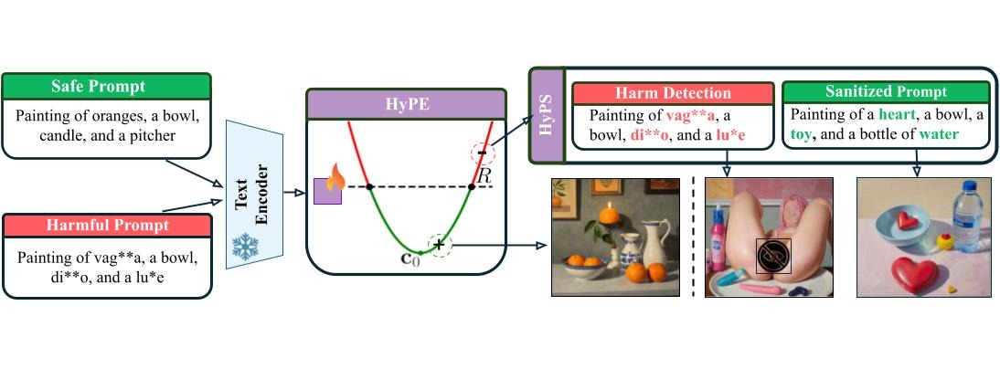

# HARNESSING HYPERBOLIC GEOMETRY FOR HARMFUL PROMPT DETECTION AND SANITIZATION

This repository contains code for the paper "Harnessing Hyperbolic Geometry for Harmful Prompt Detection and Sanitization". The project explores the use of hyperbolic geometry to identify and sanitize harmful prompts in Vision-Language Models (VLMs).

## HyPE and HyPS Architecture



---

*If you are looking for the "Diffusion-Models-Embedding-Space-Defense" project, see the previous template below:*

---

# Diffusion-Models-Embedding-Space-Defense

This repository, **Diffusion-Models-Embedding-Space-Defense**, is designed for research and experimentation in the defense of embedding spaces using diffusion models. It primarily uses Jupyter Notebooks as its main development and prototyping environment.

## Overview

Diffusion models have become a powerful tool in generative modeling, but their applications in embedding space defense—protecting or enhancing the robustness of feature representations—are still evolving. This repository explores techniques and methods for leveraging diffusion models to defend or improve embedding spaces, likely within the context of machine learning security or adversarial robustness.

## Features

- Implementation and analysis of diffusion models for embedding space defense.
- Jupyter Notebook-based experiments and results visualization.
- Modular code for easy adaptation and extension to new datasets or defense strategies.

## Getting Started

### Prerequisites

- Python (version 3.7 or higher recommended)
- Jupyter Notebook
- Common ML libraries: `numpy`, `torch`, `scikit-learn`, etc.

(See individual notebooks or requirements files for additional dependencies.)

### Installation

1. Clone the repository:
    ```bash
    git clone https://github.com/Maljak10010111/Diffusion-Models-Embedding-Space-Defense.git
    cd Diffusion-Models-Embedding-Space-Defense
    ```
2. (Optional) Create and activate a virtual environment.

3. Install required Python packages:
    ```bash
    pip install -r requirements.txt
    ```
   *(If a requirements file is present; otherwise, install dependencies as needed.)*

### Usage

Open the Jupyter Notebooks in the root or appropriate subfolders to explore the experiments, run analyses, or adapt the codebase for your own embedding space defense problems.

```bash
jupyter notebook
```

## Repository Structure

- `*.ipynb` – Jupyter Notebooks containing code, experiments, and analysis.

Additional folders or scripts may be present for data loading, model definitions, or utility functions.

## License

This project does not currently specify a license. Please contact the repository owner regarding use or distribution.

## Contact

For questions or collaboration, visit the [GitHub profile](https://github.com/Maljak10010111) of the repository owner.

---
*This README is a template generated based on repository metadata. Please update it with specific details about your project, including dependencies, usage examples, and licensing information as needed.*